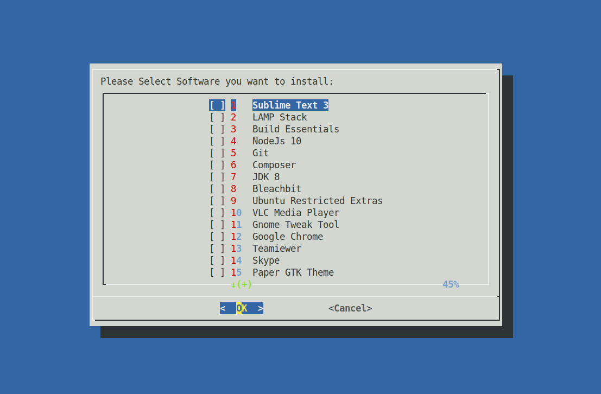

# Ubuntu software installation script 📃 📄 📑

Every time I install a new distribution based on Ubuntu, I have to manually installed some softwares 😟 😤 😢 😭.

Now it is very simple with this script 🤓 👻 👽.

```bash
sudo bash post_install.sh
```
##Dialog

Just select what you ant to install using the space key.
Use the arrow keys for navigation.
Press Enter to start the installation and Voila...... 🎊 🎉

Enjoy ✳️ 🌟 ✨ ⚡️ ☄️ 💥 🔥
